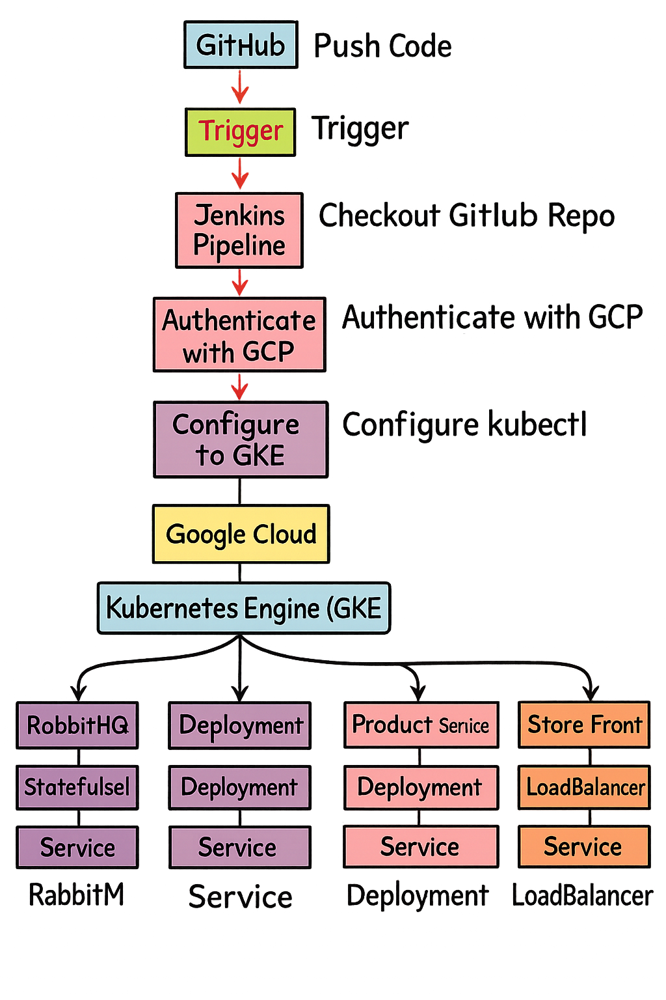

<h1 align="center">🌍 Jenkins CI/CD Pipeline for GKE Deployment with Microservices Application</h1>

This repository demonstrates a **complete DevOps pipeline** that automates the deployment of a **microservices-based application** to **Google Kubernetes Engine (GKE)** using **Jenkins**, **Terraform principles**, and **Kubernetes manifests**.

The setup provisions and deploys a sample **store application** consisting of multiple services (**RabbitMQ**, **Order Service**, **Product Service**, and **Store Front**) — showcasing modern DevOps practices like container orchestration, infrastructure as code, CI/CD automation, and monitoring.

---

<h2>🧩 Project Overview</h2>

| **Layer** | **Technology** | **Description** |
|------------|----------------|-----------------|
| CI/CD | Jenkins | Automates build, test, and deployment workflows |
| Cloud Platform | Google Cloud Platform (GCP) | Infrastructure hosting via GKE |
| Container Orchestration | Kubernetes (GKE) | Deploys and manages microservices |
| Messaging | RabbitMQ | Manages inter-service communication |
| Microservices | Order, Product, and Store Front | Handle backend and frontend logic |
| Version Control | GitHub | Stores code, pipeline, and manifests |

---

<h2>⚙️ Jenkins Pipeline Overview</h2>

The provided **Jenkinsfile** automates deployment of Kubernetes manifests to **GKE**.

### **Pipeline Stages**

| **Stage** | **Description** |
|------------|-----------------|
| Checkout Git Repository | Pulls Kubernetes YAML manifests from GitHub |
| Authenticate with GCP | Authenticates Jenkins using a GCP service account |
| Configure kubectl | Connects Jenkins to the target GKE cluster |
| Deploy to GKE | Applies Kubernetes manifests using `kubectl apply -f` |
| Verify Deployment | Checks running pods and exposed services |

<h2>🧱 Kubernetes Architecture</h2>

| **Component**   | **Type**                          | **Description**                                        |
| --------------- | --------------------------------- | ------------------------------------------------------ |
| RabbitMQ        | StatefulSet + Service             | Message broker for inter-service communication         |
| Order Service   | Deployment + Service              | Handles order placement and connects to RabbitMQ       |
| Product Service | Deployment + Service              | Manages product catalog and integrates with AI service |
| Store Front     | Deployment + LoadBalancer Service | Web frontend communicating with backend services       |

<h2>📜 Kubernetes Resources Breakdown</h2>

🐇 RabbitMQ

* StatefulSet ensures persistence and stable network identity.

* ConfigMap enables RabbitMQ plugins (Management, Prometheus).

* Exposes ports 5672 (AMQP) and 15672 (HTTP dashboard).

📦 Order Service

* Connects to RabbitMQ for queue operations.

* Includes initContainer to wait until RabbitMQ is ready.

* Has startup, readiness, and liveness probes for health checks.

🛒 Product Service

* Serves product data and communicates with AI_SERVICE_URL.

* Configured with strict CPU and memory limits for optimal scaling.

🏬 Store Front

* Frontend application exposed through a LoadBalancer Service.

* Communicates with order and product microservices.

* Configured with health probes for reliability.

<h2>🧠 Deployment Flow</h2>

* Jenkins authenticates with GCP via service account.

* Pipeline connects to GKE cluster using gcloud and kubectl.

* Jenkins applies the Kubernetes YAML (aks-store-quickstart.yaml).

* GKE provisions StatefulSet, Deployments, and Services.

* Jenkins verifies the deployment by checking pods and services.

* Application becomes accessible via LoadBalancer IP of the Store Front service.

<h2>🧰 Prerequisites</h2>

<h3> Before running the pipeline, ensure: </h3>

* Jenkins installed with Pipeline plugin

* Configured credential: gcp-service-account (type: Secret File)

* Jenkins agent has gcloud and kubectl installed

* Google Cloud Platform

  Active project: testapp-472401

* GKE cluster: jenkinscluster in region us-central1

* Service account roles:

    roles/container.admin

    roles/storage.admin

    roles/iam.serviceAccountUser

* GitHub Repository

    Contains Jenkinsfile and aks-store-quickstart.yaml

    Accessible to Jenkins

<h2>🚦 How to Run</h2>

* Open Jenkins → New Item → Pipeline

* Link this GitHub repository or paste the Jenkinsfile script.

* Ensure credentials and environment variables are updated.

* Click Build Now.

* Jenkins will:

  Clone the repository

  Authenticate with GCP

  Deploy manifests to GKE

  Verify pod and service status

<h2>🔍 Verifying Deployment</h2>

<h3> After deployment, verify Kubernetes resources: </h3> 

 * kubectl get pods
 * kubectl get svc

NAME                                READY   STATUS    RESTARTS   AGE
rabbitmq-0                          1/1     Running   0          2m
order-service-7cf7c8d94c-qpfbz      1/1     Running   0          2m
product-service-6dc8b7c54d-7pv2s    1/1     Running   0          2m
store-front-7d7bcb4b9f-4gnz2        1/1     Running   0          2m

<h2> To access the web app: </h2>

* kubectl get svc store-front

Copy the EXTERNAL-IP and open it in your browser.

<h2>🔒 Best Practices</h2>

* Store credentials and secrets securely in Jenkins Credentials Manager or Kubernetes Secrets.

* Use separate namespaces for dev, staging, and production.

* Implement Horizontal Pod Autoscaling (HPA) for dynamic scaling.

* Adopt Canary or Blue-Green Deployments for safer rollouts.

* Enable Cloud Monitoring and Logging for observability.

* Automate infrastructure provisioning using Terraform.

<h2>🧾 Directory Structure</h2>

K8Jenkins/
├── Jenkinsfile
├── aks-store-quickstart.yaml
└── README.md

Developer → GitHub Repo → Jenkins Pipeline → GCP Authentication → GKE Cluster
                                                               │
                                                               ├─ RabbitMQ (StatefulSet)
                                                               ├─ Order Service (Deployment)
                                                               ├─ Product Service (Deployment)
                                                               └─ Store Front (Deployment + LoadBalancer)

<h2>📜 License</h2>

This project is licensed under the MIT License — you are free to use, modify, and extend it for learning or production purposes.

<h2>✨ Author</h2>

Prashanth — DevOps Engineer with experience in Terraform, Jenkins, Kubernetes, and Google Cloud Platform.

